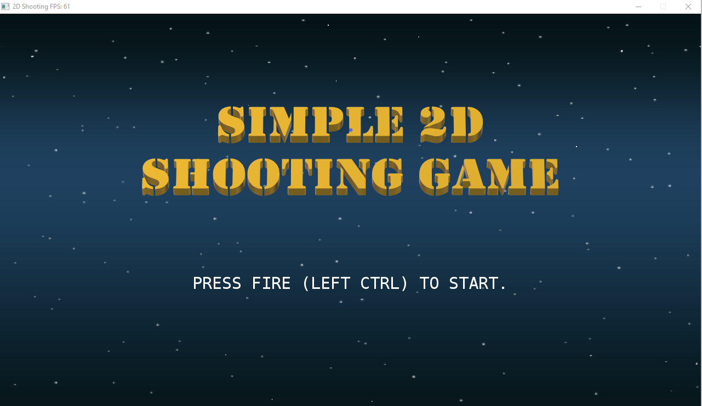
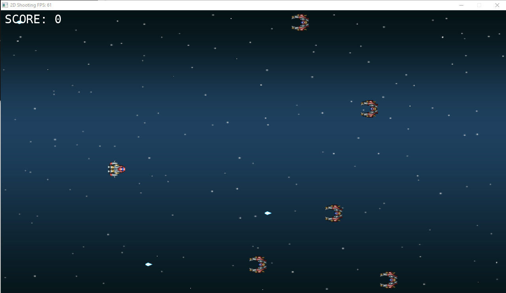
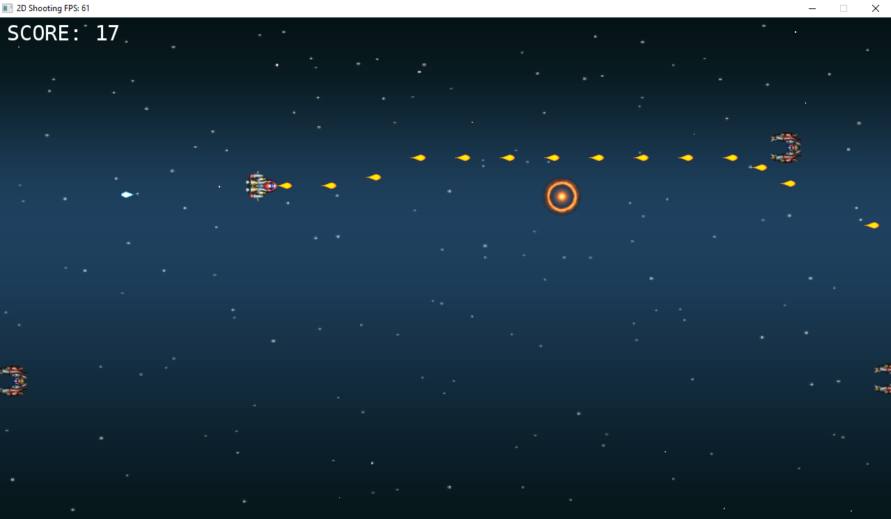
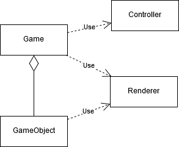
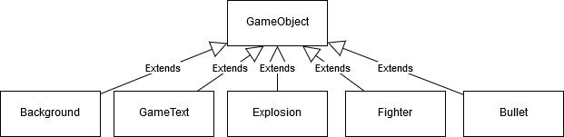

# shooting2D: A Simple 2D Shooting Game

This is a the Capstone project for the Udacity C++ Nanodegree Program. The project is created to build a simple 2D shooting game using C++ and [SDL2](https://libsdl.org/) library from the ground up.

## Dependencies for Building and Running the Project Locally
* cmake >= 3.5 
    * All OSes: [check cmake.com for installation instructions](https://cmake.org/install/)
* make >= 4.1 (Linux)
    * Linux: make is installed by default on most Linux distros
    * Windows: [mingw32-make in MinGW](http://www.mingw.org/) is used
* gcc/g++ >= 5.4
    * Linux: gcc / g++ is installed by default on most Linux distros
    * Windows: [g++ in MinGW](http://www.mingw.org/) is used
* SDL2 >= 2.0, SDL2_image >= 2.0
    * All installation instructions can be found [here](https://wiki.libsdl.org/Installation)
    * For Linux (Ubuntu), run following commands to install SDL2 and SDL2_image development libraries:
        * `sudo apt-get install libsdl2-dev`
        * `sudo apt-get install libsdl2-image-dev`
    * For Windows, get the pre-built development libraries for mingw from [here, SDL2](https://libsdl.org/download-2.0.php) and [here, SDL2_image](https://www.libsdl.org/projects/SDL_image/), then:
        * Extract downloaded libraries to a folder (e.g. C:\lib\SDL2-2.0.9 and C:\lib\SDL2_image-2.0.4)
        * Add environment variables SDL2_DIR and SDL2_IMAGE_DIR which point to the architecture folders (e.g. C:\lib\SDL2-2.0.9\i686-w64-mingw32 and C:\lib\SDL2_image-2.0.4\i686-w64-mingw32)
        * Update the paths in sdl2-config.cmake file of extracted SDL2 library (e.g. C:\lib\SDL2-2.0.9\i686-w64-mingw32\lib\cmake\SDL2\sdl2-config.cmake) to the correct paths where SDL2 library is extracted

## Basic Build and Run Instructions
1. Clone this repo.
2. Make a build directory in the top level directory: `mkdir build && cd build`
3. Compile
    * Linux: `cmake .. && make`
    * Windows: `cmake .. && mingw32-make`
4. Run: `./shooting2D`.
5. The player will first see the game title screen

6. When player press the FIRE button, the game is started



## Folder and Files Structures
```
cmake/ (CMake modules)
├─ FindSDL2_image.cmake (module for dicovering SDL2_image library and header file location)
gfx/ (Contains images of game objects)
├─ background.png
├─ enemy.png
├─ ...
src/ (Source codes)
├─ background.cpp (Define Background class which represent the game screen background)
├─ background.h
├─ bullet.cpp (Define Bullet class)
├─ bullet.h
├─ controller.cpp (Define Controller class which accept and process player input)
├─ controller.h
├─ defs.h (Constants for the game, e.g. frame rate, screen size, etc.)
├─ explosion.cpp (Define Explosion class which shows a explosion effect on screen)
├─ explosion.h
├─ fighter.cpp (Define Fighter class which represents player or enemy)
├─ fighter.h
├─ game.cpp (Define Game class which contains all game logics)
├─ game.h
├─ gameobject.cpp (Define GameObject class which represents an object can be rendered on screen)
├─ gameobject.h
├─ gametext.cpp (Define GameText class which show a text string on screen)
├─ gametext.h
├─ main.cpp (The program main function, the entry point)
├─ renderer.cpp (Define Renderer class which responsible for calling SDL2 library to render game screen)
├─ renderer.h
```

## Classes Structures
### Game classes relationship

### GameObject classes hierarchy


## Rubric point addressed
|Rubric point|Where in code|
|---|---|
|The project demonstrates an understanding of C++ functions and control structures.|controller.cpp (line6: while, line7: switch)<br/>game.cpp (line 198, 203, 208, 213, etc.: ranged-based for loops) <br/>gametext.cpp (line 12: for loop)<br/>game.h (line 73-83: functions defined for specfic action e.g. update, render, collision detection)
|The project reads data from a file and process the data, or the program writes data to a file.|render.h, render.cpp (load image from file using SDL2_image funciton, IMG_LoadTexture)|
|The project accepts user input and processes the input.|controller.h, controller.cpp	(using SLD2 function, SDL_PollEvent, to handle user input for moving and firing)|
|The project uses Object Oriented Programming techniques.|Except main.cpp and defs.h, all other .h files hold the definition of classes and .cpp files hold the implementation of corresponding classes functions.|
|Classes use appropriate access specifiers for class members.|All .h file except defs.h (properties are private, corresponding public get,set functions are defined)|
|Class constructors utilize member initialization lists.|backgroud.cpp (lines 3-5)<br>bullet.cpp (lines 3-4)<br>explosion.cpp (lines 3-6)<br>game.cpp (line 9-10)<br>(etc.)|
|Classes abstract implementation details from their interfaces.|All .h file except defs.h (comments are written to member functions to states their purposes)|
|Derived class functions override virtual base class functions.|gameobject.h (defined virtual functions Render and GetRect)<br>background.h (overriderd Render function)<br>explosion.h (overrided both Render and GetRect)<br>gametext.h (overrided both Render and GetRect)|
|The project uses move semantics to move data, instead of copying it, where possible.|game.cpp (gameobjects are move to collection|
|The project uses smart pointers instead of raw pointers.|game.h (Game objects are held using smart pointers)|